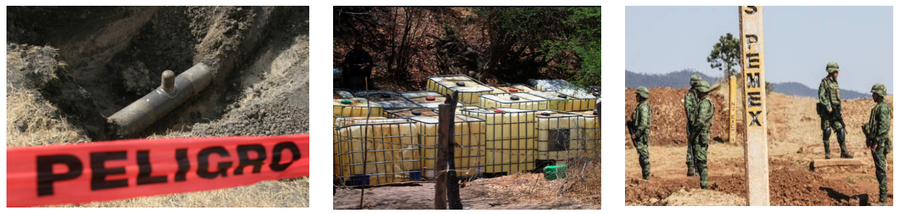
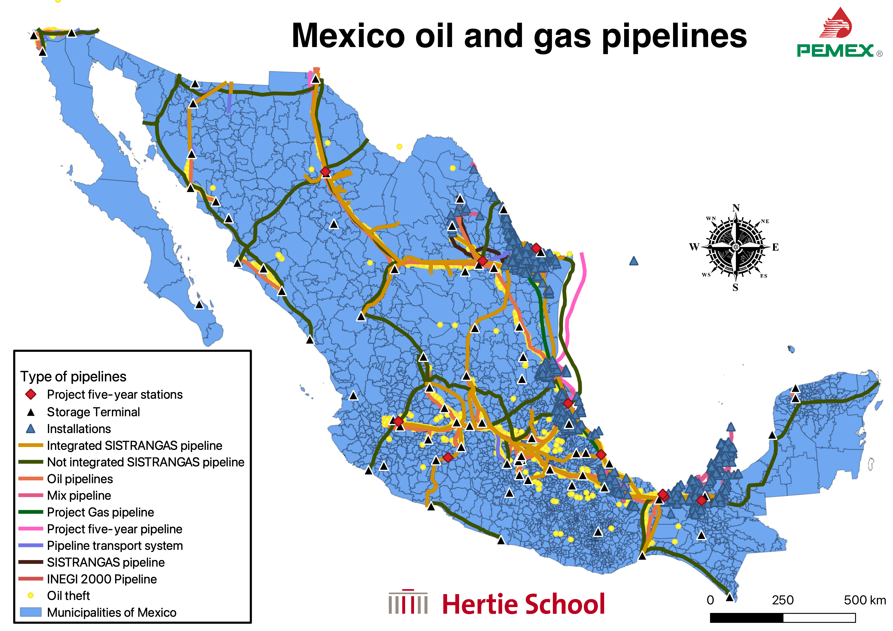
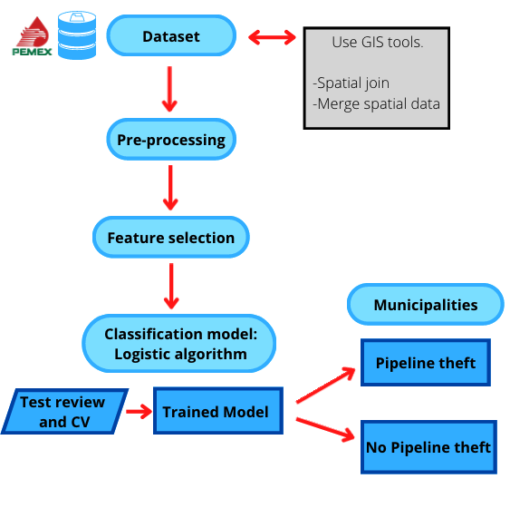
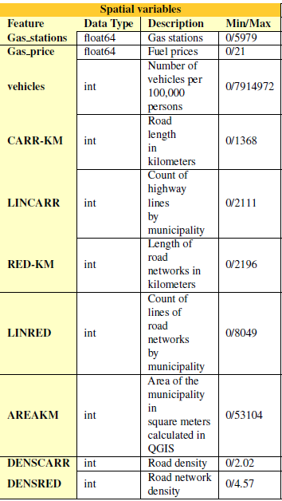
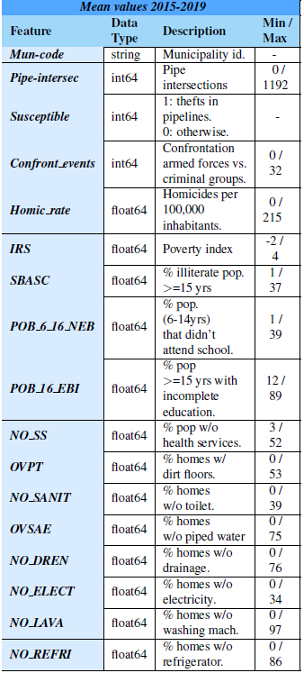
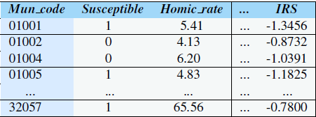
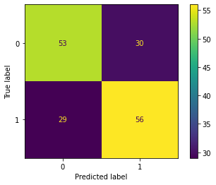
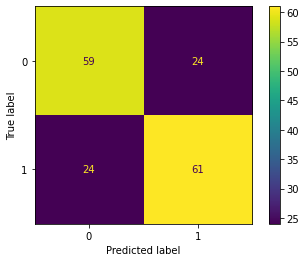
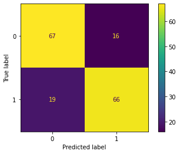

<style>
body {
text-align: justify}
</style>

```{r setup, include=FALSE}
knitr::opts_chunk$set(echo = FALSE)

# Load dependencies 
library(reticulate) # For rendering Python code 
```

```{r, fig.align='left', echo=F, out.width = "30%"}
#Hertie logo

```

```{r, fig.align='center', echo=F, out.width = "100%",  fig.cap = "Picture 1: SAòL LîPEZ/CUARTOSCURO.COM shorturl.at/dxEIM, Picture 2: shorturl.at/jpsXZ, Picture 3: Archivo Roberto Hernández - shorturl.at/fhsK2"}

#Thefts Headline picture

```

## 1. Abstract

Violence and criminal activities have risen in Mexico in the past 20 years. One problem that has been increasing is fuel theft committed by criminal groups. This is a serious problem because this activity could increase violence among criminal groups to have control over different pipelines. The main problem of clandestine gasoline theft is predicting which areas are more likely to have gasoline theft by criminal groups. With this problem, this research aims to predict which municipalities are more susceptible to experiencing gasoline theft. In this sense, our contribution is first to understand which features influence pipeline thefts in Mexico; second, to use a machine learning approach to classify which municipalities are more susceptible to be subject to gasoline theft by criminal groups; third, to promote quantitative research on the phenomenon of gasoline theft in Mexico. The project analyzed 839 Municipalities that have pipelines and classified them as "susceptible" or not. We implemented a Logistic Regression model, a Decision Tree Classifier and a Random Forest Classifier (RF). According to the results, the RF was the best with 82.14% in accuracy; 82.35% in both precision, recall, and F1 scores, and 64.28% in MCC Score.

## 2. Introduction

Violence and criminal activities have risen in Mexico in the last two decades. The criminal activities that organized crime commits vary in multiple ways. These activities include selling and exporting illicit drugs; rents from extortion, kidnapping, and theft; money laundering, and cyber crimes, among other crimes. Moreover, recently, drug trafficking is no longer the first source of income for criminal groups [@herrera2022diversifying]. In this sense, for criminal groups, fuel theft has been a trend for at least ten years. Because of these attractive fuel theft profits, different criminal groups have arisen in Mexico to exploit this illegal activity.

Pemex (Petroleos Mexicanos in Spanish) is a Mexican state-owned company that produces, transports, refines and markets oil, and natural gas. It has pipelines throughout the 32 states in Mexico for the distribution of oil and other products (Figure \@ref(fig:Mexicopipelines)). 

```{r Mexicopipelines, fig.align='center', eval = TRUE, echo = FALSE, out.width = '80%', fig.cap = "Mexico pipelines."}
#  

```


Clandestine intakes detected in Pemex pipelines have increased by 2,197% from 2008 to 2015. These attacks have been reported in 24 federal entities of the country. The database[^1] contains the affected pipelines, their exact location, the geographic location of the clandestine pipeline, the date of the attack, the state/city where the attack took place, the material used for the construction of the pipeline, the type of repair, and other data.

[^1]: Database available at https://cartocritica.org.mx/2019/tomas-clandestinas-en-pemex-2008-2015/

<aside>Thefts database.</aside>

### 2.1.	How the criminal groups steal gasoline

Criminal groups identify areas where gasoline pipelines are more vulnerable and, hence, easier to make a hole or put a provisional valve to steal gasoline; once they do this, they will try to maximize their time extracting the gasoline from the valves and putting it into big tanks [@alonso2021theft].

Other versions argue that gasoline theft happens because of the corruption inside PEMEX. However, this is only part of the story because although many operators within PEMEX operate under a framework of corruption and impunity, others collaborate or cooperate because criminal groups threaten them, so not following their orders implies significant consequences such as loss of life[^2].

Fuel theft is traded and sold on the black market for half its price, generating millions of Mexican pesos in profits for criminal groups. As a result, this problem has risen quickly, affecting the national heritage and Pemex [@peschard2021we].

[^2]: "Desde Pemex se organizaba el robo de combustible": cómo funciona la red de 'huachicoleo' que detectó el gobierno de AMLO en México" - https://www.bbc.com/mundo/noticias-america-latina-46697816

### 2.2.	Why it's important to research gasoline theft

The phenomenon of violence in Mexico is interesting to research, considering how the government tries to solve the problem by using, for example, the military for security tasks that civil institutions should be doing. In this case, research on clandestine gasoline theft is important from two perspectives: academia and public policy.

In academia, research on violence issues in Mexico is a relevant field across security studies. In the last few years, there has been an increase in new security issues that were never researched before in the quantitative area. One trend that falls into this fact is gasoline theft and clandestine pipeline intakes.

In public policy, this problem has generated a spiral of violence in Mexico due to criminal groups’ control of gasoline theft. In this way, it is relevant to approach this problem using data and machine learning techniques, as it will be much easier to identify common patterns and problems to design public security policy strategies based on scientific evidence.


### 2.3.	What can be proposed?

  From a public policy perspective, we have different goals. For example, Pemex is a Mexican state-owned company that produces, transports, refines and markets oil and natural gas. It has pipelines throughout Mexico for oil, hydrocarbon, and gas distribution. Also, it's one of the few remaining state-own companies. Fuel theft and clandestine fuel intakes detected in Pemex pipelines have increased by 2,197% from 2008 to 2015, as illustrated in Figure \@ref(fig:Pipelinespecific). In other words, that represents an important part of the public budget that the Mexican state is losing. 

```{r Pipelinespecific, fig.align='center', eval = TRUE, echo = FALSE, out.width = '80%', fig.cap = "Theft's location"}
#  
knitr::include_graphics("figures/Pipeline specific.png")
```

  With our results and insights, we could develop a short, medium, and long-term policy to help prevent vulnerable municipality pipelines from being attacked by criminal groups. This is one of the main problems that Pemex needs to resolve, and this type of analysis could help to reach that goal in the long run with the help and collaboration of the Mexican authorities.

  The main factors of this research comprise a spatial factor and a classification factor. The idea is to capture the most critical factors that help us explain which parts or problems related to fuel theft have a greater weight when analyzing the information. However, since it is a multifactorial problem, it is well known that reducing the complexity of fuel theft and the multiple actors that are involved in a particular model do not reliably explain what could be happening. However, as a starting point, many areas of opportunity can open other lines of research.


## 3. Related work

The literature is quite extensive regarding spatial analysis, crime, and security patterns in a given territory. Similarly, spatial analysis and machine learning have become relevant in recent years. Regarding our approach, no literature directly resembles the relationship between territory and gasoline theft. However, similar techniques provide a reasonably solid idea that it can be implemented in the area. For example, authors Lorenc, KUŹNAR, Lerher, and Szkoda predicted the probability of cargo theft for individual cases in railway transport. They used neural networks (ANN) and their results and metrics were above 90% [@lorenc2020predicting]. Although the problem is not the same, the mode of operation is similar, since the railways have the same spatial component throughout the territory. 

In the same way, Behnam Nikparvard and Jean-Claude Thill establish the importance of spatial variables when trying to implement machine learning models in different approaches from social sciences and other research fields. According to the authors, the properties of the spatial data are not comprehensively approached by the learning algorithm; Moreover, they argue that the spatial data properties are the most promising prospects for the future of spatial machine learning in the research field [@ijgi10090600]. Finally, Nicolas Gilardi and Samy Bengio analyze multiple spatial classification models to determine in which circumstances the spatial approach becomes optimal with classification models and under specific parameters [@unilcomparison].

## 4.	Proposed method

The nature of our research has two components: a spatial component and a classification component. In the spatial component, we can analyze the interaction of the variables and how the territory’s configuration can influence gasoline theft. On the other hand, we have the classification component, which is one of the most used to determine predictions based on multiple characteristics [@james2021introduction]. In this sense, we will explore both options to determine which aspect can predict more accurately and help us better understand how certain variables affect clandestine gasoline theft in Mexico.

With the literature review and the nature of our data, three models were implemented: Logistic Regression, Decision Tree, and Random Forest. Although each one has advantages in its use, they are classification models that will help us address the municipalities where gasoline theft is most likely to occur.


#### 4.1.	Logistic Regression

The Logistic Regression as Classification will be our baseline for multiple reasons. Since we want to predict which municipal gasoline pipelines are more likely to be stolen (as a binary response), logistic regression is a great tool to predict such a phenomenon. Similarly, this model helps us to understand how the independent variables influence the municipalities with gasoline pipelines as a first approximation. Finally, multiple authors have obtained exciting results using classification models (specifically logistic regression) in researching security issues that are very similar to our research question, so it is ideal for strengthening our methodology by implementing what has already been done in Academia.

Given that we are classifying municipalities with pipelines, we can classify them into two classes: municipalities that had theft of their gasoline in their lines and municipalities that did not experience this phenomenon, as illustrated in Figure \@ref(fig:flow-chart-final). Finally, the advantages of using logistic regression are that its interpretation is simple, requires less training time, and can perform a good understanding of results without structured complexity. However, these same reasons are why it should be taken as a first approximation or baseline for more complex models.


```{r flow-chart-final, fig.align='center', eval = TRUE, echo = FALSE, out.width = '50%', fig.cap = "Final flow chart for the Logistic Regression Model"}
#  

```

#### 4.2.	Decision Tree and Random Forest

The advantages of a decision tree and a Random Forest can be varied. In our context, spatial diversification and the variables that influence a specific municipality to suffer a robbery can also be represented as nodes and sheets to reach different conclusions. In this sense, the internal nodes, or our data partition, can be taken as evidence, and the leaves of said nodes are considered categories. We have variables like homicide rate, number of vehicles, and gasoline prices, among others that are categorical and our outcome (theft or not) is also categorical. Using this specific model to classify municipalities susceptible to fuel theft is an opportunity since it can even be used as an alternative to statistical methods to find results. Within the literature, a classification model based on decision trees is a step even to determine the consistency of our modeling in different configurations.


```{r flow-chart-DT, fig.align='center', eval = TRUE, echo = FALSE, out.width = '60%', fig.cap = "Flow chart for Decision Tree Model"}
#  
knitr::include_graphics("figures/flow-chart-DT.png")
```


## 5.	Experiments

### 5.1.Data

Our data can be divided into two parts: the first is the data that describes the pipelines in Mexico, and the spatial and non-spatial data that can help our analysis and modeling. The second part is the data on clandestine pipeline hydrocarbon product thefts in the municipalities in Mexico over time. Since we are in the first approach, we analyzed the data within a period from 2015 to 2019. This period was chosen since there was a significant increase in the theft of hydrocarbon products throughout the country. Therefore, the variables obtained in panel data were reduced to an average observation (municipality). In Figure \@ref(fig:Municipalitiesstolen) it can be appreciated the municipalities where thefts occurred. 

```{r Municipalitiesstolen, fig.align='center', eval = TRUE, echo = FALSE, out.width = '60%', fig.cap = "Municipalities that suffered attacks on pipes."}
#  
knitr::include_graphics("figures/Mexico.png")
```

#### 5.1.1.	Spatial data

Since our phenomenon is spatial, we used geographic information systems (GIS) to capture different variables within the municipalities. For the above, ArcGIS and Qgis software were used. It is worth mentioning that obtaining the shape files (geographic files that store geometric location and other attributes) of the fuel pipelines in Mexico is problematic because the information is not advertised like in other institutions. However, through the platform of the National Hydrocarbons Information Center, dependent on the National Hydrocarbons Commission, it was possible to obtain shape files of all gasoline and gas pipelines, control centers, storage centers, and any other space-related to hydrocarbons[^3]. More than ten types of pipelines with different products cross through Mexico. Since the available databases do not report what kind of product was stolen (considering that the vast majority is gasoline), we assume that different products can be stolen on these different pipelines, considering that it has been reported that criminal groups have also stolen natural gas and other oil derivatives[^4].

[^3]: Database available at https://mapa.hidrocarburos.gob.mx/

[^4]: "El huachicol se extiende al gas natural, advierte el gestor de ductos" - https://bit.ly/3TpV0mW.


We captured relevant information that can influence the hydrocarbon thefts, such as the number of gas stations and their prices in the different municipalities. For the above, the spatial location of gas stations throughout Mexico was downloaded and combined with their average gasoline price between 2015 and 2019. This information comes from the Energy Regulatory Commission (CRE for its acronym in Spanish)[^5].

[^5]: Database available at https://bit.ly/3fSvdpU

Finally, as already mentioned, since we have a particular component, the ideal would be to implement a spatial model that captures these territorial relationships to obtain greater explanatory power. However, since the methodology we use is based on a classification, spatial variables were included to capture the phenomenon of gasoline theft from a territorial point of view. For example, Figure \@ref(fig:SpatialVariables) describes the variables that we consider relevant to control for this phenomenon in our model.

```{r SpatialVariables, fig.align='center', eval = TRUE, echo = FALSE, out.width = '40%', fig.cap = "List of spatial variables"}
#  

```

Once we obtained all our spatial variables, a projection of the layers and points of our variables was made on a map containing the municipalities in Mexico. With this projection, we implemented a spatial joint, which counts how many times a point is found in each polygon (in this case, our municipalities). From here, we got several results. The first was the number of gas stations per municipality and the number of intersections of pipelines across the municipalities. In this same analysis, we managed to codify the municipalities that have pipelines below their territories and those that do not. This step is essential since we avoid a selection bias we want to predict theft based on all the municipalities that have pipelines.
With this wrangling, we obtained a database where for each municipality, it was possible to identify which one has pipelines in their territories, the number of gas stations, the average price of fuel, and the number of times multiple fuel lines cross municipalities.

As mentioned before, including spatial variables in our model controls for the territorial factor. In this sense, variables such as the number of vehicles per 100,000 inhabitants or the density of roads by municipality give us an idea of how, once gasoline is stolen, it can be transported by different means. Given that this phenomenon has precisely this characteristic, what is expected is that these variables manage to capture municipalities with a greater or lesser network of highways or different paths to hide or evade the authorities with the stolen gasoline.

#### 5.1.2.	Non-Spatial data

In the non-spatial data, it was more direct to treat the variables, since they contained the municipality’s identifier key to join the information with our spatial variables. In these non-spatial data, we considered social characteristics that can influence the context in which a municipality may have a greater probability that their pipelines will be “attacked.” Since theft is a violent and security issue, we consider variables such as the number of homicides per 100,000 inhabitants and the confrontation between the military and criminal groups. 

Finally, as the phenomenon of violence is related to a component of poverty, we obtained the social lag index constructed by the National Council for the Evaluation of Social Development Policy (CONEVAL for its acronym in Spanish), a Mexican institution [@CONEVAL]. We calculated the average value between 2015 and 2019. For this, 2019 was calculated based on the average annual variation observed between 2015 and 2020. The social lag index scores can go from negative (less lag) to positive (more lag) values. Accompanied by this index, we include the variables with which the index was calculated.


#### 5.1.3.	Clandestine pipeline hydrocarbon products thefts in Mexico

Officially, if one requests information to obtain data about fuel theft, PEMEX responds that they cannot provide that information for national security reasons. However, Mexican platforms such as CartoCritica or Serendipia have made a legal effort to obtain these databases, to which they managed to provide us access. The data that we have reports the coordinates of the municipalities where the theft events happened by date and other characteristics [@Cartocritica]. 

The second database contains the number of theft events on PEMEX pipelines, grouped by the municipality, from 2000 to 2018. This data was obtained directly from PEMEX Company based on the Federal Law on Transparency and Access to Public Information of Mexico (Request number 1857200094319, registered on March 21st, 2019) reported by the media [@Serendipia]. 

The database contained 28 variables and 839 observations. In Figure \@ref(fig:SocialVariables) we show the features that our database has, and a sample can be observed in Figure \@ref(fig:Databasesample).

```{r SocialVariables, fig.align='center', eval = TRUE, echo = FALSE, out.width = '40%', fig.cap = "List of social (non-spatial) variables."}
#  

```

```{r Databasesample, fig.align='center', eval = TRUE, echo = FALSE, out.width = '40%', fig.cap = "Database sample."}
#  

```


### 5.2. Software and hardware

The use of software was essential in the construction of spatial variables. As we already mentioned, ArcGis and Qgis were used to determine the spatial patterns and to be able to identify them with our municipalities of interest. On the other hand, the Python language was used to carry out the implementation of the model.
In terms of hardware, we worked on Google Colab and Jupyter Notebook. In this case, the computational power was not demanding since the observations we handled (due to the nature of the work) were not so many.

### 5.3. Experiment method and experiment details

We did multiple approximations and compared them in two analyses, using the three models already mentioned: Logistic Algorithm, Decision Tree, and Random Forest. We distinguished two moments with our database for these models. In the first analysis, we used the average of our data from 2015-2019. In the same way, for the second analysis, the exact implementation we only applied the data for 2019 in all terms, training, and testing sets. The idea of the above is to cover scenarios considering or condensing more points in time in a single database and only taking the year in which clandestine tapping was most reported.

During the initial evaluation of the database, the relation between each feature and the classification target was analyzed. For instance, the frequency of each variable does not identify a clear division in the observations that could help us to discover a bias. Additionally, the features were analyzed two by two to recognize some visual identity. Even so, it was not possible to make assumptions about each feature’s correlation with the target classification based on these visual elements.

The data was preprocessed and scaled with Standard Scaler. The sample data from 2015-2019 was balanced since approximately 50% of the observations refer to susceptible municipalities and the rest to non-susceptible (or less susceptible) municipalities, as noticed in Figure \@ref(fig:Databasebalancing). 


```{r Databasebalancing, fig.align='center', eval = TRUE, echo = FALSE, out.width = '40%', fig.cap = "Database balancing"}
#  
knitr::include_graphics("figures/Database balancing.png")
```


This balancing is important, as it allows the model to be trained on a database that has a proportional number of positive and negative cases. The database was split into train and test randomly, and training data corresponded to 80% of the total database.


## 6.	Results

### 6.1. Analysis

As can be seen in Figure \@ref(fig:resultsf) these are the results for both scenarios using the mean from 2015-2019 and only the data for 2019 in the three different models.


```{r resultsf, fig.align='center', eval = TRUE, echo = FALSE, out.width = '100%', fig.cap = "Models scores using the database with mean values from 2015-2019"}
#  
knitr::include_graphics("figures/results_chart_mean.png")
```


For the baseline using the Logistic Regression model, the results were promising. On the other hand, it was expected that we could have better results after adjusting the parameters and selecting some variables. For instance, the Figure \@ref(fig:ConfusionmatrixLR) presents the confusion matrix using the logistic regression model. Our next goal was to reduce false positives and false negatives significantly. For this purpose, we decided to add other variables that could help us understand the phenomenon of gasoline theft and other adjustments to our model.


```{r ConfusionmatrixLR, fig.align='center', eval = TRUE, echo = FALSE, out.width = '40%', fig.cap = "Confusion matrix results - LR model"}
#  

```

The Matthews correlation coefficient (MCC score) was 0,2974 (computed using the testing data). It shows that despite the previous results, this model was not capable to get good results in all confusion matrix categories (true positives, false negatives, true negatives, and false positives).
It is mandatory to point out that the evaluation of a prediction model should never be performed based on just one parameter. Furthermore, it is the knowledge of the database and the results of various metrics that will enable a faithful assessment of the model's performance.

In addition to the Logistic Regression model, we decided to run the Decision Tree model and the Random Forest to check which would get better prediction scores. We used the same training and test split set (20% for the test portion).

For the Decision Tree model, there were no limitations either in depth or in the number of observations per node, and the MCC score was 47.6% as presented in Figure \@ref(fig:resultsf). In fact, the results were better than the previous ones collected for the Logistic Regression model. Figure \@ref(fig:ConfusionmatrixDT) presents the confusion matrix for the Decision Tree model.

```{r ConfusionmatrixDT, fig.align='center', eval = TRUE, echo = FALSE, out.width = '40%', fig.cap = "Confusion matrix results - DT model"}
#  

```

As shown in Figure \@ref(fig:resultsf), the Random Forest model obtained the best scores among the three models, regardless of the scoring methodology used. The MCC score was 64.3\% which, in line with the other expressive results, demonstrates the power of this model to predict cases of theft in Mexico. The confusion matrix (Figure \@ref(fig:ConfusionmatrixRF) presents the confusion matrix for the Random Forest model, and it proves how balanced this model predicts theft cases using the database with spatial features.


```{r ConfusionmatrixRF, fig.align='center', eval = TRUE, echo = FALSE, out.width = '40%', fig.cap = "Confusion matrix results - RF model"}
#  

```

We also tested the models with a database containing only records for the year 2019. The results are shown in Figure \@ref(fig:results2019), but they demonstrate that this was not a good alternative, probably because that database was not balanced between the cases of municipalities susceptible to theft.

```{r results2019, fig.align='center', eval = TRUE, echo = FALSE, out.width = '100%', fig.cap = "Models scores using only 2019 values"}
#  
knitr::include_graphics("figures/results_chart_2019.png")
```


It is also crucial to mention that some features were removed from training and test data because we made a backward elimination analysis. Before this selection, we used the Random Forest embedded Gini Importance function to check which variables had the lower importance for the models and the results are presented in the Figure \@ref(fig:RFGinibefore).

```{r RFGinibefore, fig.align='center', eval = TRUE, echo = FALSE, out.width = '80%', fig.cap = "Random Forest - Gini Importance - BEFORE backward variable/feature selection"}
#  
knitr::include_graphics("figures/RF_Gini_importance_before.png")
```

After that, we applied the method proposed by Grover \cite{BackwardElimination} and realized that some variables ('Confront\_events', 'CVEGEO', 'Population', 'IRS', 'POB\_6\_16\_NEB', 'POB\_16\_EBI', 'OVPT', 'OVSAE', 'NO\_DREN', 'NO\_ELECT', 'LINRED', 'vehicles\_15\_19') do not contribute to the prediction capacity of our models. After this selection, the final database was composed of 16 variables.

The updated version of the Gini Importance chart (Figure \@ref(fig:RFGini)) demonstrates that this selection was beneficial as a way to maintain the project's score level with less computational processing.

```{r RFGini, fig.align='center', eval = TRUE, echo = FALSE, out.width = '80%', fig.cap = "Random Forest - Gini Importance - AFTER backward variable/feature selection"}
#  
knitr::include_graphics("figures/RF_Gini_importance.png")
```


## 7.	Conclusions

Gasoline theft in Mexico is an issue that must be addressed from multiple points of view. Pemex is losing millions of pesos without any of its security strategies. The results of this research are promising; however, much remains to be done. We need even more data to build more detailed models and implement more modern approaches like deep learning and other methodologies already trending in academia. If we strengthen this analysis, it can be a great starting point for designing specific security strategies based on our results. In terms of public policy and based on the results observed, it is necessary to cover those municipalities where the crossing of pipelines is more significant and, therefore, there is a greater probability of theft. Likewise, within PEMEX, corruption and impunity that makes criminal groups manage to extract fuel from multiple pipelines must be combated. In general, this research work is a good starting point for designing strategies based on scientific evidence that shed light on the best responses to combat the problem of gasoline theft in Mexico.

## 8.	Acknowledgments

We want to especially thank Alejandra Padilla, director of Serendipia for accessing the gasoline theft database in Mexico. Since it is not easy to obtain this database officially, the hard efforts of Alejandra and the entire Serendipia team made this work possible. We also thank Professor Slava and our teaching assistant Paulina for the feedback we received throughout the Machine Learning course.
